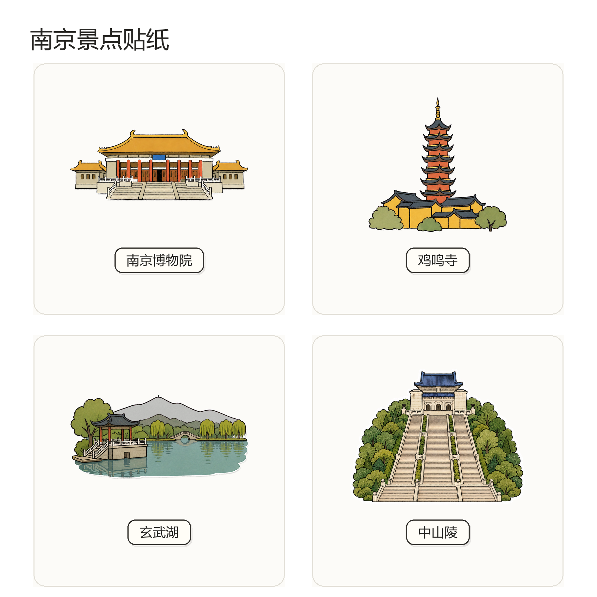
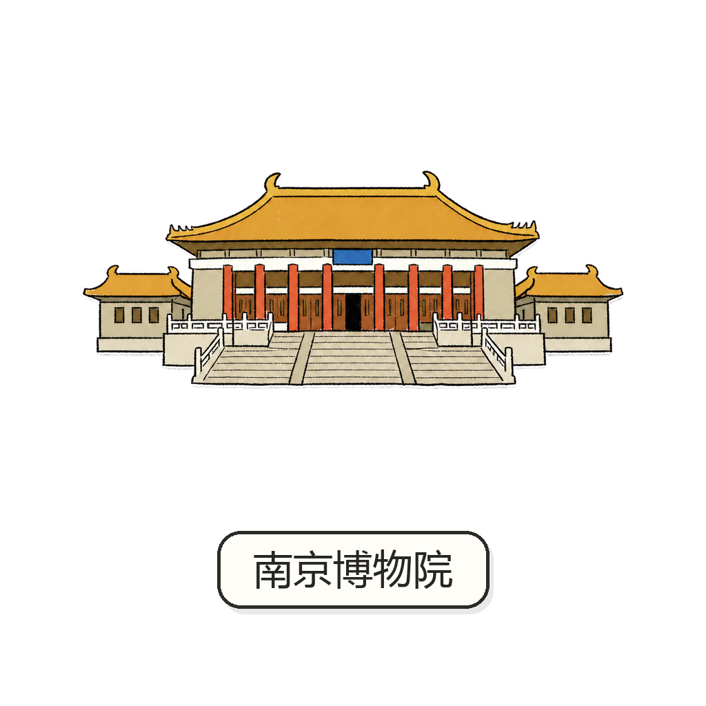
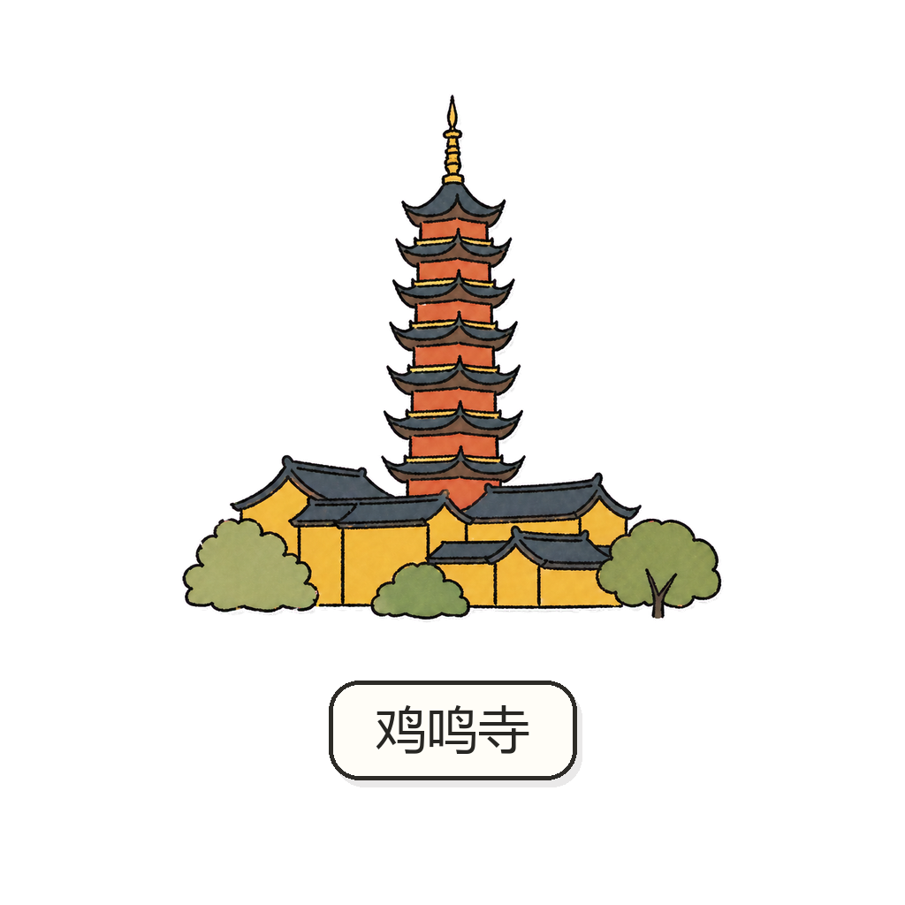
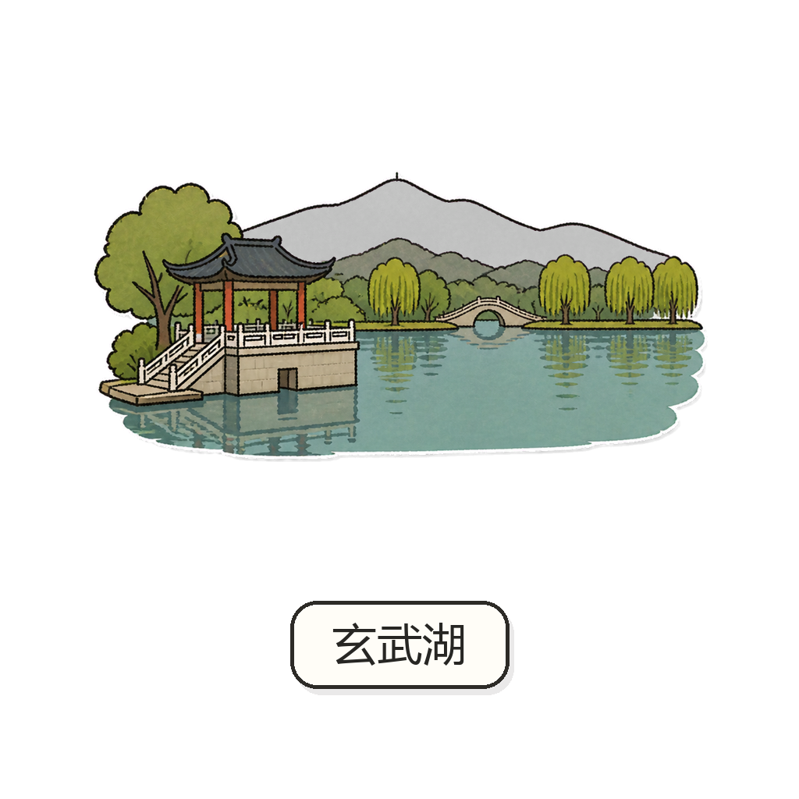
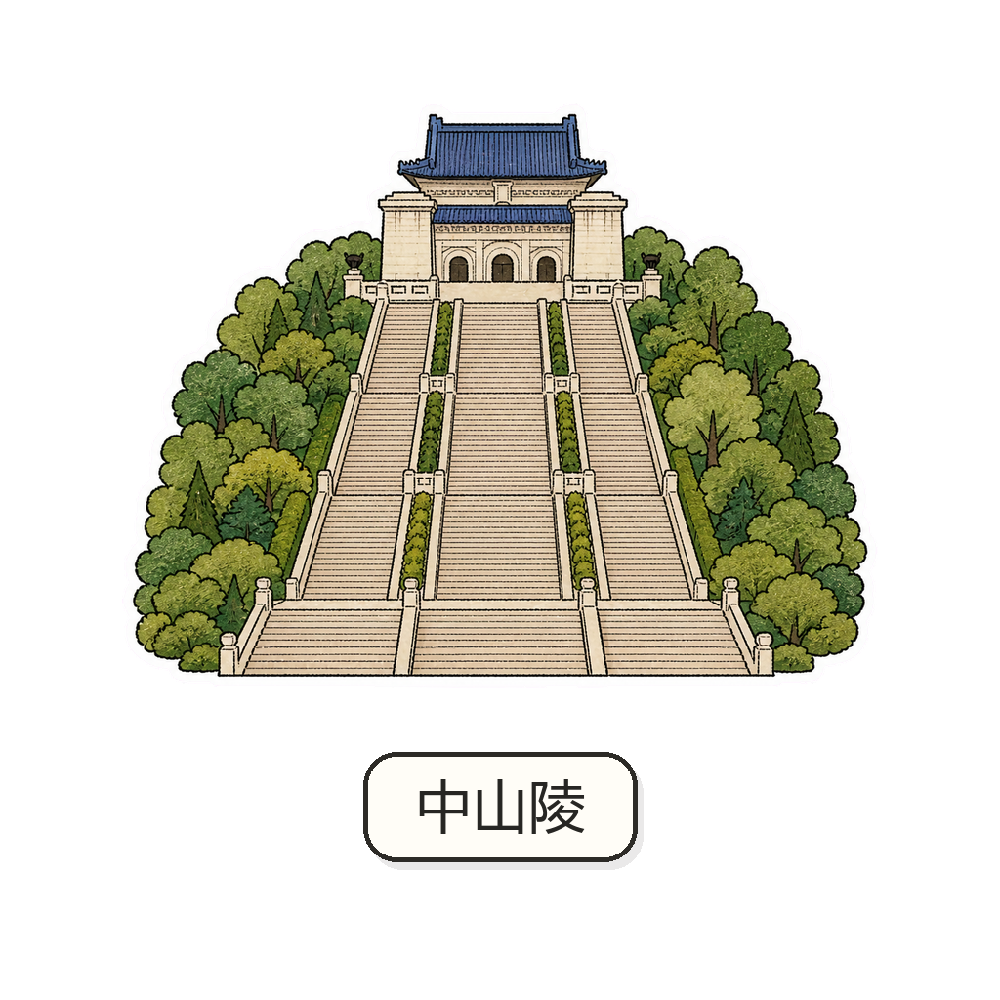

# 🗺️ City Sticker

> **从真实城市地标出发，生成一套既能认出“它是谁”，又能放进同一张旅行地图里的手绘景点贴纸。**

`city-sticker` 不只把景点照片卡通化，也不会让图片模型凭印象画一个差不多的建筑。它先研究真实地标，找出真正决定辨识度的轮廓、结构和空间关系，再把这些特征放进稳定的手绘视觉语言。



当前展示：**南京博物院 · 鸡鸣寺 · 玄武湖 · 中山陵**

同一套线条、白边、色彩和中文名牌；四个地方既要看起来属于同一张地图，也要分别一眼能认出来。

---

## ✨ 什么是 City Sticker？

一张可用的城市贴纸，需要同时守住两件事：

- **Landmark Truth**：画面确实来自这个真实景点，而不是泛化的博物馆、寺庙或湖泊。
- **Visual System**：换到另一个地点以后，线条、色彩、留白和名牌仍然属于同一套产品。

```text
真实地标照片 / 官方资料
            ↓
     Landmark Anchors
            ↓
   ┌────────┴────────┐
   │                 │
地标真实特征      统一视觉语言
   │                 │
   └────────┬────────┘
            ↓
       City Sticker
```

> **文字负责确认地点，画面本身负责让人认出地点。**

## 🏞️ 可以画什么？

| 类型 | 南京测试 | 主要挑战 |
|---|---|---|
| 大型建筑 | 南京博物院 | 轮廓、屋顶与入口结构 |
| 寺庙 / 塔 | 鸡鸣寺 | 塔体比例与综合色彩 |
| 自然景观 | 玄武湖 | 水体、岸线与代表性景观 |
| 纪念建筑 | 中山陵 | 中轴、台阶与主体建筑 |

这套流程也适用于博物馆、桥梁、山、海岸、公园等真实旅行地点。重点不在题材，而在能否找到并保留它最不可替代的识别特征。

## 🔍 它怎么工作？

```text
STEP 01｜研究真实地标
STEP 02｜提取 3–5 个 Landmark Anchors
STEP 03｜锁定 Style Reference
STEP 04｜生成透明贴纸
STEP 05｜加入统一中文名牌
STEP 06｜检查 Alpha / Safe Margin / 128·96·64 px
```

详细研究方法、Prompt 结构和验收条件都在 [SKILL.md](SKILL.md) 与 [references/](references/) 中，README 只保留使用前最需要了解的部分。

## 🎨 南京四景测试

| 南京博物院 | 鸡鸣寺 |
|---|---|
|  |  |
| 简化大型传统建筑后，继续保留屋顶层级、入口和主体比例。<br>[下载透明 PNG](examples/nanjing/nanjing-museum_transparent.png) | 塔寺不能只靠黄色建筑和名称识别，塔体、屋顶与院墙关系必须成立。<br>[下载透明 PNG](examples/nanjing/jiming-temple_transparent.png) |

| 玄武湖 | 中山陵 |
|---|---|
|  |  |
| 用水体、岸线、亭台和远山验证自然景观的简化能力。<br>[下载透明 PNG](examples/nanjing/xuanwu-lake_transparent.png) | 在小贴纸尺度下保留长轴线、台阶、蓝色屋顶和主体纪念建筑。<br>[下载透明 PNG](examples/nanjing/zhongshan-mausoleum_transparent.png) |

中山陵的来源与识别锚点记录在 [Research Manifest](examples/nanjing/zhongshan-mausoleum-research.md) 中。外部照片只用于研究，不作为公开成果打包进仓库。

## ✒️ 设计标准

- 先研究真实地标，再生成图像。
- 每个地点提取 3～5 个有来源支持的识别关键点。
- 同一批次使用固定的 Style Reference 和手绘钢笔语言。
- 白边、阴影、留白和中文名牌保持一致。
- `LANDMARK_NAME_REQUIRED = true`：准确中文名牌必须位于主体正下方，并合入透明 PNG。
- 名牌不能遮挡主体，也不能替代地标本身的辨识度。
- 默认输出 1024×1024 透明 PNG，并在 128、96、64 px 下复查。

## ⚙️ 运行方式

Skill 不绑定某一个图片模型。Coding Agent 负责 `Research → Prompt / Manifest → Image Generation → QA`，可用的图片工具负责 raster generation 或 editing。

## 🚀 快速安装

```bash
npx skills add fishjoyness/city-sticker
```

默认安装到当前项目；增加 `--global` 可安装到用户级目录。

### 手动安装

```bash
git clone https://github.com/fishjoyness/city-sticker.git
```

## 🤖 Supported Agents

| Agent | Project | Global |
|---|---|---|
| OpenAI Codex | `.agents/skills/city-sticker/` | `~/.agents/skills/city-sticker/` |
| Claude Code | `.claude/skills/city-sticker/` | `~/.claude/skills/city-sticker/` |
| WorkBuddy | `.workbuddy/skills/city-sticker/` | `~/.workbuddy/skills/city-sticker/` |

安装后如未立即出现，重新打开 Agent 会话。

## 💬 怎么使用？

```text
请使用 city-sticker，为西安钟楼制作一张景点贴纸。
先完成真实地标研究并输出 Landmark Anchors，
再生成主体正下方带中文名牌的透明 PNG。
```

也可以只要求研究、Prompt 或现有 PNG 的质量检查，不必每次都生成图片。

## 🙋 FAQ

**一定要提供景点照片吗？**

不一定。你可以提供参考图，也可以允许 Agent 检索官方、Wikimedia 和地图实拍来源。没有可靠事实参考时，不应直接生成。

**已经有中文名称，为什么还强调建筑辨识度？**

因为名牌只确认地点。遮住文字以后，轮廓和关键结构仍应让人想到这个景点。

**可以只生成一张吗？**

可以。Skill 默认按单个地标工作，不会自行扩成整座城市的批量任务。

**一定要使用某个图片模型吗？**

不用。模型可以更换，真实地标研究、Style Reference 和 QA 规则保持不变。

**能用于旅行小程序吗？**

可以。透明 PNG 适合后续制作地图 Marker 或贴纸素材；运行时尺寸和交互仍由产品代码负责。

## ❤️ 最终目标

不是生成一批风格相似的旅游图标，而是让一座城市里的不同地标，在保持真实身份的同时，自然地属于同一张地图。

## 目录

```text
city-sticker/
├─ SKILL.md
├─ prompts/
├─ references/
├─ scripts/
├─ evals/
└─ examples/nanjing/
```

## Related Skill

[city-guide-character](https://github.com/fishjoyness/city-guide-character) 用于生成地图角落的轻量城市导览人物。两个 Skill 可以独立安装，也可以共享同一套旅行产品手绘语言。

## License

本仓库原创内容采用 [MIT License](LICENSE)。
